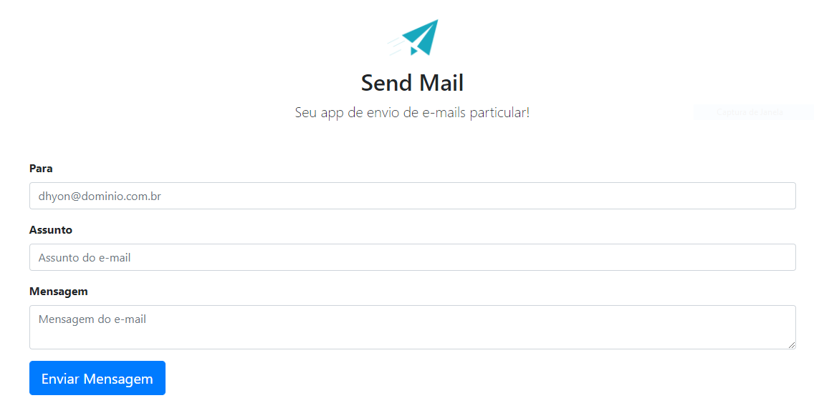

<h1 align="center">App Send Mail</h1>

  

<!-- Telas -->

## Sobre o projeto

### Tela inicial

    

Sistema de envio de e-mail utilizando o php mailer. Front-end criado com bootstrap4.

### Recursos usados

- [PHP](https://www.php.net/)
- [Bootstrap 4](https://getbootstrap.com/)
- [lib - PHPMailer](https://github.com/PHPMailer/PHPMailer)

## Sobre

Projeto desenvolvido totalmente para fins acadêmicos.
